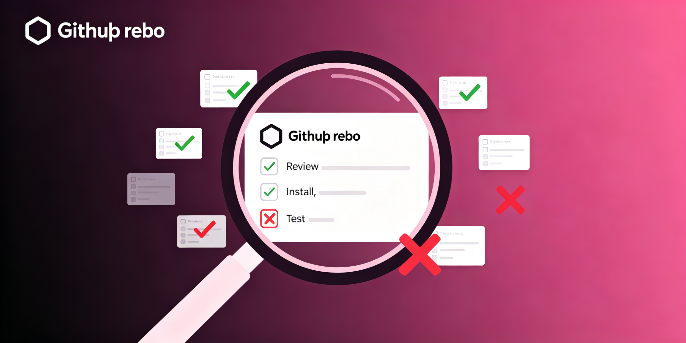

<div align="center">

# 外部技能评估

**给一个外部仓库，按定位→审查→安装→A/B 实测→沉淀五步决定到底要不要用。**


[它解决什么问题](#它解决什么问题) - [为什么比手动强](#为什么比手动强) - [工作流](#工作流) - [实测参数](#实测参数) - [快速开始](#快速开始)

</div>

---

## 它解决什么问题

丢来一个外部 GitHub 仓库或插件，"学一下、看哪个对我有用"。直接装上就用容易踩坑：分不清是整合包还是本体、脚本里藏硬编码密钥、装了到底有没有用也说不清。这个仓库定义一套评估闭环，最后给明确"用或不用"的结论。

## 为什么比手动强

| 直接装上就用 | 本仓库 |
|---|---|
| 把整合包当本体 | 先定位本体，查 README 链接链回上游 |
| 不看依赖就装 | 判断是否绑特定运行时 / 模型无关 / 可直接装 |
| 不审代码 | 浅克隆看脚本有无网络调用 / 写敏感路径 / 可疑命令 |
| 装完凭感觉说有用 | 隔离子代理 A/B 实测，父代抽查验证 |
| 结论散落聊天里 | 沉淀飞书文档 + 多维表格，结论给过程不展开 |

## 工作流

```
定位本体（GitHub 搜仓库 / 读 README / 区分整合包）
   ↓
判断依赖边界（能不能装）
   ↓
浅克隆审查（安全 + 跑自带验证脚本）
   ↓
安装到 skills 目录并 skill_view 确认 available
   ↓
A/B 实测（对照 vs 加载新 skill，串行派发）
   ↓
沉淀结论（对比表 + 用/不用建议）
```

## 实测参数

- **A/B 关键**：delegate_task 串行派发、禁并发；实验组必须在 context 写明先 `skill_view(name)` 再按协议执行
- **安装校验**：装完必须 `skill_view(name)` 看 `readiness_status: available`，不能只 ls 目录
- **lark-cli 建文档**：二进制在 `/home/user/bin/lark-cli`，`--content @path` 只接受相对路径
- **外部 skill 不改内部文件**：如 J-Space 有 verify_suite.py 校验 premise 逐字一致

## 快速开始

```bash
# 1. 查本体
curl -s 'https://api.github.com/search/repositories?q=<查询>&per_page=10'
curl -s 'https://api.github.com/repos/<owner>/<repo>/readme'   # content 字段 base64 解码

# 2. 浅克隆审查
git clone --depth 1 <url>

# 3. 安装并校验
cp -r <repo>/<skill-dir> /home/user/skills/<name>
# 装完用 skill_view(name) 确认 readiness_status: available
```

相关评估案例见 `SKILL.md` 内的避坑与参考文件说明。

## License

MIT
